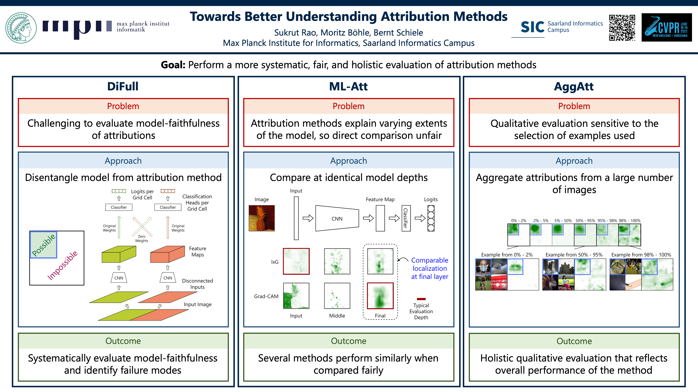

# Towards Better Understanding Attribution Methods

[arXiv](https://arxiv.org/abs/2205.10435) | [Code](https://github.com/sukrutrao/Attribution-Evaluation)

Code for the paper:

Sukrut Rao, Moritz Böhle, Bernt Schiele. Towards Better Understanding Attribution Methods. In IEEE/CVF Conference on Computer Vision and Pattern Recognition (CVPR) 2022.

## Overview



## Setup

### Prerequisites

* Python 3.7+
* pip

### Installing the Package

The package can be installed using pip. Use the following steps:

1. Clone the repository.

```bash
git clone https://github.com/sukrutrao/Attribution-Evaluation
cd Attribution-Evaluation
```

2. Install the package.

```bash
pip install .
```

Or in editable mode as

```bash
pip install --editable .
```

## Quick Start Example

The following shows an example of using the provided scripts to prepare the data, run an attribution method, compute and plot localization scores, and visualize AggAtt bins and examples from each bin. In addition, this the functions can be directly called (as described in the next sections) in your own code by importing the package.

1. Set paths for data and create directories to save outputs:

```bash
IMAGENET_IMAGES_PATH="" # Set path to ImageNet validation images here
IMAGENET_LABELS_FILE="" # Set path to text file containing ImageNet validation labels here, with each line containing space separated image file name and label ID
mkdir data 
mkdir outputs
mkdir outputs/attributions
mkdir outputs/visualizations
```

2. Convert the ImageNet validation set to PyTorch tensors:

```bash
python scripts/convert_imagenet_to_tensors.py --images_path $IMAGENET_IMAGES_PATH --labels_path $IMAGENET_LABELS_FILE --save_path data/imagenet
```

3. Generate grid dataset:

```bash
python scripts/generate_grid_dataset.py --dataset_path data/imagenet --scale 2 --save_path data/imagenet_grid --num_test_images 500 --conf_threshold 0.99 --models vgg11 resnet18 --cuda
```

4. Run Grad-CAM on GridPG at the final layer of VGG11:

```bash
python scripts/run_attributor.py --dataset_path data/imagenet_grid --cuda --model vgg11 --setting GridPG --layer Final --save_path outputs/attributions --exp GradCam --config test
```

5. Compute localization scores and plot them in a box plot:

```bash
python scripts/evaluate_localization.py --dataset_path data/imagenet_grid --model vgg11 --setting GridPG --layer Final --attributions_path outputs/attributions --save_path outputs/visualizations --exp GradCam --config test
```

6. Visualize AggAtt bins:

```bash 
python scripts/visualize_aggatt.py --dataset_path data/imagenet_grid --model vgg11 --setting GridPG --layer Final --attributions_path outputs/attributions --save_path outputs/visualizations --exp GradCam --config test --head_pos_idx 0
```

7. Visualize examples from each AggAtt bin:

```bash 
python scripts/visualize_examples.py --dataset_path data/imagenet_grid --model vgg11 --setting GridPG --layer Final --attributions_path outputs/attributions --save_path outputs/visualizations --exp GradCam --config test --num_examples 10 --head_pos_idx 0
```

## Data

### Data Format for the Scripts

The evaluation settings evaluate attribution methods on `N` x `N` grids of images. The scripts in the implementation assume that such a dataset is stored on the disk in a dictionary with the following fields:
* `data`: A `torch.Tensor` of the shape `(B, C, H*N, W*N)`, where `B` is the number of grid images, `C` is the number of channels, `H` is the grid cell height, `W` is the grid cell width, and `N` is the grid dimension.
* `labels`: A `torch.Tensor` of the shape `(B, N*N)`, where `B` is the number of grid images and `N` is the grid dimension.
* `input_dims`: A list or tuple of the form `[C, H, W]`, where `C` is the number of channels, `H` is the grid cell height, and `W` is the grid cell width.
* `num_classes`: The number of classes in the dataset. It is assumed that the labels are integers in `[0, num_classes-1]`.
* `scale`: The dimension `N` of the `N` x `N` grids.

### Scripts

* To convert the ImageNet validation set to PyTorch tensors, use [`convert_imagenet_to_tensors.py`](scripts/convert_imagenet_to_tensors.py).
* To generate a grid dataset, use [`generate_grid_dataset.py`](scripts/generate_grid_dataset.py)

The options and their descriptions for each script can be seen by calling the script with the `-h` flag.

## Generating Attributions

### Attribution Methods

Implementations or wrappers are provided for the following attribution methods:
* [Gradient](https://arxiv.org/abs/1312.6034)
* [Guided Backprop](https://arxiv.org/abs/1412.6806)
* [Integrated Gradient](https://arxiv.org/abs/1703.01365)
* [InputxGradient](https://arxiv.org/abs/1704.02685)
* [Grad-CAM](https://arxiv.org/abs/1610.02391)
* [Grad-CAM++](https://arxiv.org/abs/1710.11063)
* [Ablation-CAM](https://ieeexplore.ieee.org/document/9093360)
* [Score-CAM](https://arxiv.org/abs/1910.01279)
* [Layer-CAM](https://ieeexplore.ieee.org/document/9462463)
* [Occlusion](https://arxiv.org/abs/1311.2901)
* [RISE](https://arxiv.org/abs/1806.07421)

The classes for each can be found in [`attribution/attributors.py`](attribution_evaluation/attribution/attributors.py), and their evaluation configurations can be set in [`attribution/configs.py`](attribution_evalution/attribution/configs.py). All attribution methods are accessed through the `AttributorContainer` class, which evaluates a specific configuration of an attribution method on a specific model at a specific layer.

#### Evaluating on other attribution methods

To evaluate on a new attribution method, subclass from the `ExplainerBase` class in [`attribution/attributors.py`](attribution_evaluation/attribution/attributors.py), define the `attribute` function, and define a (possibly empty) configuration in [`attribution/configs.py`](attribution_evaluation/attribution/configs.py).

### Models

This implementation provides wrappers for evaluating on [VGG11](https://arxiv.org/abs/1409.1556) and [Resnet18](https://arxiv.org/abs/1512.03385), defined in [`models/models.py`](attribution_evaluation/models/models.py).

#### Evaluating on other models

To use a different model, subclass from the `ModelBase` class and implement each of its functions for that model.

### Settings

As described in the paper, we use three attribution settings: GridPG, DiFull, and DiPart. These are defined in [`models/settings.py`](attribution_evaluation/models/settings.py).


### Scripts

Attributions can also be generated directly using the script [`run_attributor.py`](scripts/run_attributor.py). The options and their descriptions for the script can be seen by calling the script with the `-h` flag.

## Evaluating Attributions

### Evaluating Localization Scores

Functions to compute and plot the localization scores in box plots can be found in [`evaluation/localization.py`](attribution_evaluation/evaluation/localization.py). Localization scores can be computed by calling the `get_localization_score` function, and box plots can be generated by calling the `plot_localization_scores_single` function.

Localization scores for a single attribution method can also be generated and plotted directly using the script [`evaluate_localization.py`](scripts/evaluate_localization.py). The options and their descriptions for the script can be seen by calling the script with the `-h` flag.

### Generating AggAtt Visualizations

AggAtt visualizations for a set of attributions can be generated by calling `visualize_aggatt` defined in [`evaluation/visualization.py`](attribution_evaluation/evaluation/visualization.py). By default, visualizations are generated for the top-left corner of the grid, with bins demarcated at intervals specified in the paper.

This can also be accessed directly using the script [`visualize_aggatt.py`](scripts/visualize_aggatt.py). The options and their descriptions for the script can be seen by calling the script with the `-h` flag.

### Visualizing Examples

Examples of attributions from each AggAtt bin, for a set of attributions, can be visualized by calling `visualize_examples` defined in [`evaluation/visualization.py`](attribution_evaluation/evaluation/visualization.py). The number of examples to be visualized can be at most equal to the number of attributions in the smallest AggAtt bin.

This can also be accessed directly using the script [`visualize_examples.py`](scripts/visualize_examples.py). The options and their descriptions for the script can be seen by calling the script with the `-h` flag.


## Citation

Please cite our paper as follows:

```tex
@InProceedings{Rao2022CVPR,
    author    = {Sukrut Rao and Moritz Böhle and Bernt Schiele},
    title     = {Towards Better Understanding Attribution Methods},
    booktitle = {Proceedings of the IEEE/CVF Conference on Computer Vision and Pattern Recognition (CVPR)},
    year      = {2022},
}
```

## License

This license for this repository can be found [here](LICENSE).

## Acknowledgements

Some of the code in this repository uses or is based on code from [moboehle/CoDA-Nets](https://github.com/moboehle/CoDA-Nets) and the [Captum](https://captum.ai) library.
